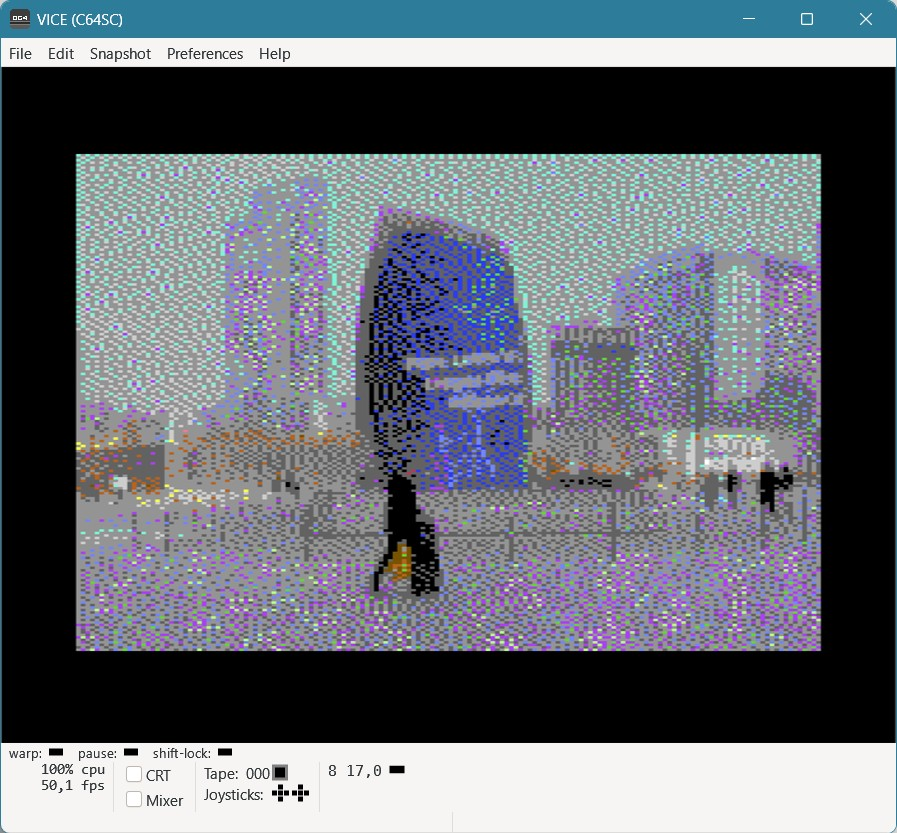
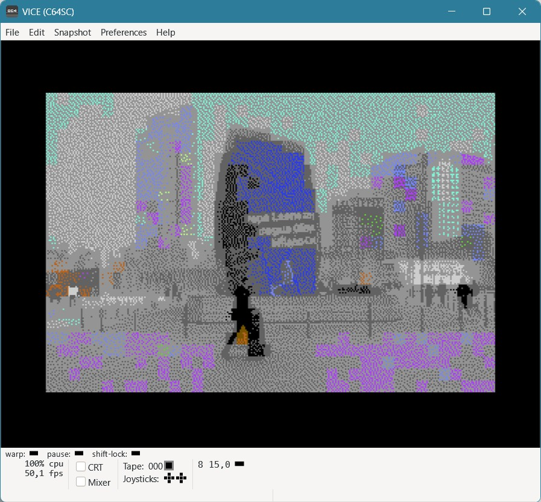
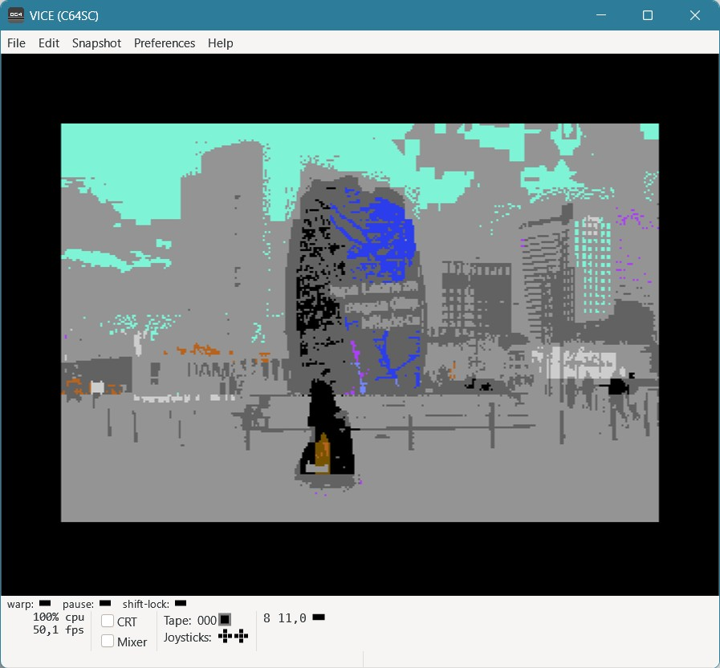

Casasoft ImageConverter and ImageConverterGUI
==========================================

This document provides detailed information about the two projects related to image conversion for Commodore 64:

## ImageConverter - Command Line Tool

Converts 320x200 PNG/BMP images to C64 bitmap format, producing PRG files for direct loading on a Commodore 64.

### Usage Examples

```bash
# Convert to multicolor format (default)
dotnet run --project ImageConverter/ImageConverter.csproj -p $E000 -c $D800 input.png

# Convert to hires (2-color) format
dotnet run --project ImageConverter/ImageConverter.csproj -2 -p $E000 -c $D800 input.png

# Disable dithering
dotnet run --project ImageConverter/ImageConverter.csproj -d input.png

# Adjust brightness bias (reduces dark colors)
dotnet run --project ImageConverter/ImageConverter.csproj --brightness=0.5 input.png
```

### Output Files

- **Multicolor mode**: `.bm.prg` (bitmap), `.sc.prg` (screen RAM), `.co.prg` (color RAM), `.bg.prg` (background color)
- **Hires mode**: `.bm.prg` (bitmap), `.sc.prg` (screen RAM)

### Options

| Option | Description |
|--------|-------------|
| `-q, --quiet` | Suppress banner output |
| `-h, -?` | Show help |
| `-2, --hires` | Convert to 2-color hires format instead of multicolor |
| `-p, --pixeladdress=` | Bitmap address (default: $E000) |
| `-c, --coloraddress=` | Color RAM address (default: $D800) |
| `-b, --backgroundaddress=` | Background color address (default: $D021, VIC-II register) |
| `-o, --out=` | Output file name (default: same as input with .prg extension) |
| `-d, --no-dither` | Disable Floyd-Steinberg dithering (plain quantization) |
| `--brightness=` | Brightness bias 0.0-1.0 favoring brighter colors (default: 0.35) |
| `--brightness-mode=` | Where to apply bias: 'quantization', 'selection', or 'both' (default) |

### Samples

The `c64/samples/` folder contains sample images demonstrating the ImageConverter output:

#### Multicolor Bitmap Conversion

The C64 multicolor mode uses 160x200 resolution with double-wide pixels (4 colors per 8x8 cell):

| Image | Description |
|-------|-------------|
|  | Multicolor bitmap with dithering - smooth color transitions and reduced banding |
|  | Hires (2-color) bitmap with dithering - standard resolution with error diffusion |

#### Hires Bitmap Conversion

The C64 hires mode uses full 320x200 resolution with 2 colors per 8x8 cell:

| Image | Description |
|-------|-------------|
|  | Hires bitmap without dithering - sharp, clean output for simple images |

#### Running on C64

To display converted images on a real C64 or emulator:

1. Load the appropriate viewer: `LOAD"MCVIEWER",8,1` (multicolor) or `LOAD"HRVIEWER",8,1` (hires)
2. Run the program: `RUN`
3. Enter the image name (without extension) when prompted
4. The viewer loads all component files and displays the image

The viewers configure the VIC-II chip for bitmap mode and restore the original screen configuration when you press ENTER.

## ImageConverterGUI - Avalonia GUI

**Interfaccia grafica Avalonia (Windows/Linux/macOS) per il convertitore di immagini C64, basata sulle librerie esistenti `Commodore`, `CommodoreImages`, `Helpers` e sui controlli `Casasoft.Avalonia.Controls` (repository `Contemporary_CDV`).**

### Cosa fa

- Carica un'immagine in **qualsiasi formato supportato da ImageMagick** (PNG, JPG, BMP,
  GIF, TIFF, WEBP, ...), di qualunque dimensione: il ridimensionamento a 160x200 (multicolor)
  o 320x200 (hires) è gestito internamente dal convertitore (`C64BitmapConverterBase.DownscaleImage`),
  quindi non è necessario pre-scalare l'immagine come richiesto invece dal tool a riga di comando.
- Permette di scegliere:
  - **Multicolor** (160x200, 4 colori per cella) o **Hires** (320x200, 2 colori per cella)
  - Dithering Floyd-Steinberg on/off
  - Bias di luminosità (0.0-1.0) e a quale fase applicarlo (quantizzazione / selezione / entrambi)
  - Indirizzi di memoria C64 (bitmap, schermo, sfondo — quest'ultimo solo in multicolor)
- Mostra l'**anteprima** (320x200, come apparirebbe su un vero C64) accanto ai parametri.
- Permette di **salvare l'anteprima** (PNG/JPG/BMP) e di **salvare i file Commodore 64**
  (`.bm.prg`, `.sc.prg`, e in multicolor anche `.co.prg`/`.bg.prg`), con la stessa
  convenzione di nomi usata da `ImageConverter`.

### Prerequisiti e passi di integrazione

1. **Riferimento a Casasoft.Avalonia.Controls**: il progetto è nella solution separata
   `Contemporary_CDV`. Apri `ImageConverterGUI.csproj` e correggi il percorso relativo
   nel `<ProjectReference>` in base a dove hai clonato quella repository, es.:
   ```xml
   <ProjectReference Include="..\..\Contemporary_CDV\Casasoft.Avalonia.Controls\Casasoft.Avalonia.Controls.csproj" />
   ```
   In alternativa, se preferisci non dipendere da un secondo repository in fase di build,
   pacchettizza `Casasoft.Avalonia.Controls` come NuGet locale e referenzialo con
   `<PackageReference>`.

2. **Nota sulle quantum depth di Magick.NET**: `CommodoreImages` (e quindi questo progetto)
   usa `Magick.NET-Q8-AnyCPU`, mentre `Casasoft.Avalonia.Controls` dichiara una dipendenza da
   `Magick.NET-Q16-AnyCPU` (usata solo da `ImageViewer.SetImage(MagickImage)`). Questo progetto
   **non chiama mai** quel metodo: converte invece l'immagine in un `Avalonia.Media.Imaging.Bitmap`
   (via round-trip PNG in memoria, vedi `ToAvaloniaBitmap` in `MainWindow.axaml.cs`) e lo assegna
   a `ImageViewer.Source`, che è tipizzato `Bitmap?` e non ha nulla a che fare con ImageMagick.
   Questo evita conflitti di tipo tra i due package, ma se in futuro aggiungi altro codice che
   passa direttamente `MagickImage` tra i due progetti, dovrai allineare entrambi sulla stessa
   quantum depth (consigliato: Q8, per coerenza con `CommodoreImages`/`ImageConverter`).

3. **Aggiungere il progetto alla solution**:
   ```bash
   dotnet sln CommodoreUtils.sln add ImageConverterGUI/ImageConverterGUI.csproj
   ```

4. **Build/Run**:
   ```bash
   dotnet build -c Release ImageConverterGUI/ImageConverterGUI.csproj
   dotnet run --project ImageConverterGUI/ImageConverterGUI.csproj
   ```

### Note implementative

- La selezione hires/multicolor usa `IC64BitmapConverter<IC64BitmapData>` esattamente come
  `ImageConverter/Program.cs`, sfruttando la covarianza dell'interfaccia (`out TData`).
- Gli indirizzi (`$E000`, `$C000`, `$D021`) sono validati con `CommandLineHelpers.GetIntParameter`,
  la stessa utility già usata dal tool a riga di comando, quindi accettano sia `$XXXX` che `0xXXXX`
  che notazione decimale.
- La Color RAM è sempre salvata a `$D800` (fisso), come nel tool CLI.
- Il file `.bg.prg` (colore di sfondo, un solo byte) viene generato solo in modalità multicolor,
  perché in hires non esiste un registro di sfondo condiviso (vedi `C64HiresData`).

## Build Commands

```bash
# Build ImageConverter project
dotnet build -c Release ImageConverter/ImageConverter.csproj

# Build ImageConverterGUI project
dotnet build -c Release ImageConverterGUI/ImageConverterGUI.csproj
```